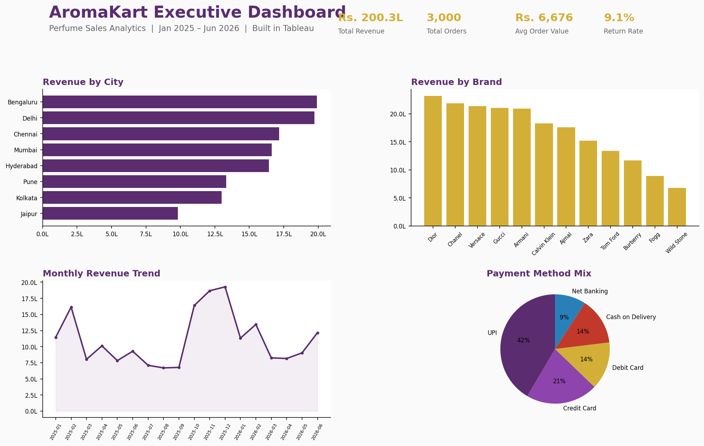

# 🧴 AromaKart Perfume Sales Analytics

An end-to-end Data Analyst portfolio project — data validation, Excel dashboarding, SQL
analysis, Python EDA, and a Tableau dashboard — built around a realistic 18-month sales
dataset for a fictional Indian online perfume retailer, **AromaKart**.



## Business Problem

AromaKart sells 12 perfume brands across 18 major Indian cities but has been making
inventory, discount, and marketing decisions on gut feeling rather than data. This project
answers: **Where is revenue coming from, who are the best customers, which products/cities
deserve more investment, and where is money being lost to returns and over-discounting?**

Full write-up: [`docs/business_problem.pdf`](docs/business_problem.pdf)

## Project Structure

```
AromaKart-Perfume-Sales-Analytics/
│
├── README.md                   ← you are here
├── requirements.txt             Python dependencies
│
├── data/                        Source data
│   ├── perfume_sales.csv            3,000-row raw dataset
│   └── perfume_sales.db             Same data loaded into SQLite
│
├── sql/                         SQL analysis
│   ├── analysis_queries.sql         15 business-question queries
│   └── query_results.pdf            Query output, pre-run and documented
│
├── notebooks/
│   └── perfume_analysis.ipynb       Full EDA notebook (pre-executed, outputs included)
│
├── scripts/
│   └── perfume_analysis.py          Same analysis as a standalone script
│
├── dashboards/
│   ├── excel/
│   │   ├── Perfume_Dashboard.xlsx   KPI dashboard, 5 live charts, formula-driven
│   │   ├── Pivot_Tables.xlsx        Pivot-ready table + 3 pre-built cross-tabs
│   │   └── excel_guide.pdf          Step-by-step walkthrough
│   └── tableau/
│       ├── Perfume_Dashboard.twb    5-worksheet Tableau workbook
│       ├── dashboard_preview.png    Static preview of the dashboard
│       └── dashboard_story.pdf      Narrative + how to rebuild it yourself
│
├── visuals/                     6 exported chart PNGs (from the Python analysis)
│
├── docs/                        Project documentation
│   ├── business_problem.pdf
│   ├── data_dictionary.pdf
│   ├── business_questions.pdf
│   ├── project_summary.pdf
│   ├── python_explanation.pdf
│   └── github_setup_guide.pdf
│
├── career/                      Interview prep & resume
│   ├── resume/
│   │   ├── ATS_Data_Analyst_Resume.docx
│   │   └── ATS_Data_Analyst_Resume.pdf
│   ├── Resume_Bullets.docx
│   ├── Interview_QA_Data_Analyst.pdf
│   ├── Interview_QA_SQL_Fundamentals.pdf
│   ├── Interview_QA_SQL_ProjectDeepDive.pdf
│   └── Project_Explanation_Script.pdf
│
└── social/
    └── LinkedIn_Post.txt        Ready-to-post project announcement
```

## Dataset

- **3,000 order-line records**, Jan 2025 – Jun 2026
- **18 cities**, **12 brands**, **27 products**, **5 payment methods**
- Every `Total_Amount` is internally consistent with `Price`, `Quantity`, and
  `Discount_Percentage` — no missing values, no duplicate `Order_ID`s

Full column reference: [`docs/data_dictionary.pdf`](docs/data_dictionary.pdf)

## Tools & Skills Demonstrated

| Tool | What was built |
|---|---|
| **Excel** | KPI dashboard with 5 live charts, SUMIFS/COUNTIFS summary tables, 3 pivot-style cross-tabs |
| **SQL (SQLite)** | 15+ queries covering revenue trends, customer segmentation, seasonality, and returns |
| **Python (Pandas/Matplotlib)** | Full EDA notebook with 6 charts and a written summary of findings |
| **Tableau** | 5-worksheet dashboard combining city, brand, time-series, delivery, and payment views |

## Key Findings

1. Revenue is strongly seasonal, peaking around **Diwali (Oct–Nov)** and **New Year (Dec–Jan)**.
2. **Metro cities** (Bengaluru, Mumbai, Delhi) generate the most revenue and orders.
3. **Premium brands** (Dior, Chanel, Versace) earn more per order but sell in lower volume than
   **budget brands** (Fogg, Wild Stone, Ajmal) — a classic margin-vs-volume trade-off.
4. **Premium perfumes have a meaningfully higher return rate** than budget perfumes.
5. **UPI is the dominant payment method**, consistent with broader Indian e-commerce trends.
6. A meaningful share of total revenue comes from **repeat customers**, supporting a loyalty
   program business case.

## Quick Start

| I want to... | Do this |
|---|---|
| See the data | Open `data/perfume_sales.csv` in Excel |
| Explore the Excel dashboard | Open `dashboards/excel/Perfume_Dashboard.xlsx` |
| Run SQL queries | Open `data/perfume_sales.db` in DB Browser for SQLite, run `sql/analysis_queries.sql` |
| Run the Python analysis | `pip install -r requirements.txt`, then open `notebooks/perfume_analysis.ipynb` |
| View the Tableau dashboard | Open `dashboards/tableau/Perfume_Dashboard.twb` in Tableau Desktop/Public |
| Prep for interviews | Read everything in `career/` |

## About This Project

This is a portfolio project built to demonstrate end-to-end Data Analyst skills — from raw
data generation through business-question framing, multi-tool analysis, and dashboarding —
in a realistic retail e-commerce context.

---
*Built as a self-guided Data Analyst portfolio project.*
